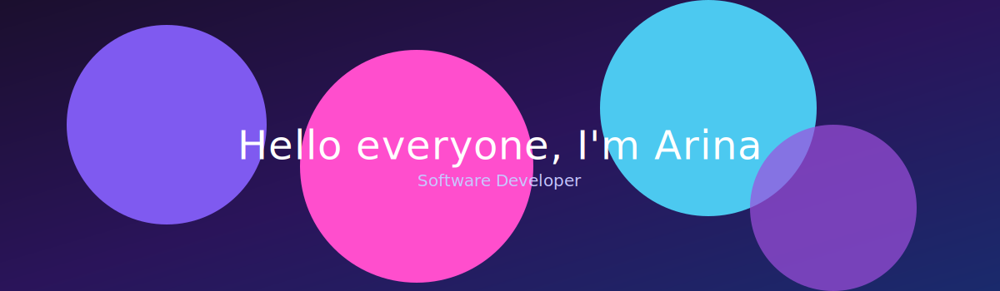

  

* 🟣​  I'm based in Italy
* 🟣​  You can contact me at [kosiakov.arina@gmail.com](mailto:kosiakov.arina@gmail.com)
* 🟣​  I'm currently working on [ArtFlow app](http://github.com/ArinaKosiakov/artFlow)
* 🟣​  I really hate bugs, like real ones

